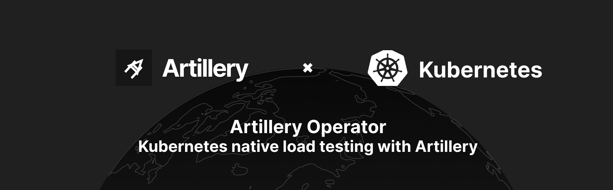
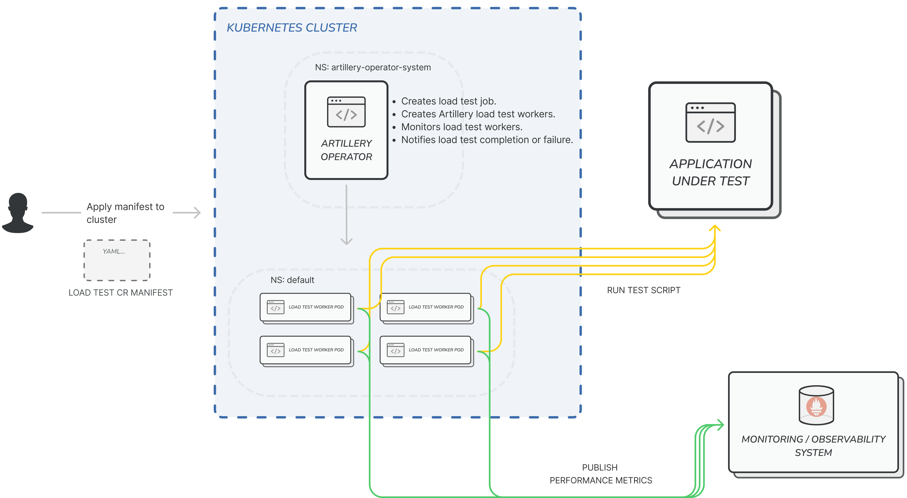

# ⚠️ This project is no longer maintained

We are working on adding Kubernetes support directly into the [Artillery CLI](https://github.com/artilleryio/artillery) instead.

----

# Artillery Operator

An operator to create and run distributed Artillery load tests from a Kubernetes cluster, at scale.

- It implements
  the [Operator pattern](https://kubernetes.io/docs/concepts/extend-kubernetes/operator/#operators-in-kubernetes).
- Created Load tests are first class Kubernetes citizens based
  on [Custom Resources](https://kubernetes.io/docs/concepts/extend-kubernetes/api-extension/custom-resources/).
- Load tests run existing
  [Artillery test scripts](https://www.artillery.io/docs/guides/guides/test-script-reference).

You can interact with created and running load tests via `kubectl`. And, monitor them with K8s UI tools too.

__SREs__, use the Operator to set up a self-service load testing framework on any K8s cluster.

__Developers__, create and apply [CRs manifests](#loadtest-manifest) to run distributed load tests from K8s at scale.

## How it works

## Get up and running

- [Deploy the Operator in your own cluster](docs/trial-in-cluster.md)
- [Run Load Tests](docs/run-load-tests.md)
- [Known issues](docs/known-issues.md)

## Developing the Operator

- [Developing locally using KinD](docs/develop-local-cluster.md)
- [Developing using a remote AWS EKS cluster](docs/develop-remote-cluster.md)

## License

The Artillery Operator is open-source software distributed under the terms of
the [MPLv2](https://www.mozilla.org/en-US/MPL/2.0/) license.
