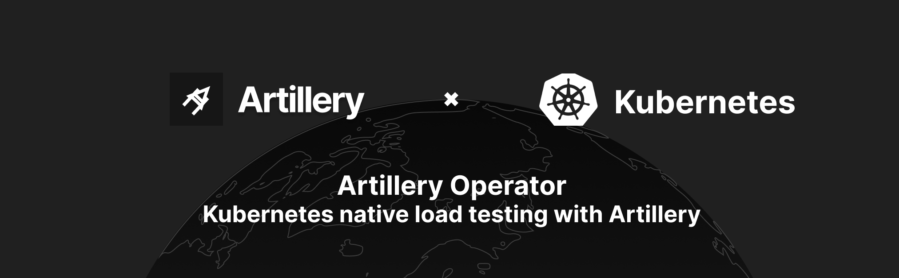

[](https://shields.io/)



# Developing the Operator using a remote AWS EKS cluster

## Pre-requisites

- [Go installed](https://golang.org/doc/install).
- [Docker Desktop](https://docs.docker.com/desktop/#download-and-install) up and running.
- [eksctl installed](https://eksctl.io/introduction/#installation) to set up a remote cluster
  on [AWS EKS](https://aws.amazon.com/eks/), `brew tap weaveworks/tap; brew install weaveworks/tap/eksctl` on macOS.

## Overview

Use these instructions to deploy the operator remotely on an AWS EKS cluster. You will need the following:

- Either use or create (using `eksctl`) a remote Kubernetes cluster to host and run the operator. We're
  using [AWS EKS](https://aws.amazon.com/eks/) but feel free to use another provider.
- A remote container registry (e.g. Docker Hub, etc..) to store the operator image for deployment.
- To get comfortable with the `make` commands required to update and deploy the operator.

## Create + configure access to a remote cluster

**Skip this if you already have a remote cluster ready.**

### Create an EKS cluster

We'll be setting up a remote on AWS EKS using `eksctl`.

```shell
eksctl create cluster -f hack/aws/eksctl/cluster.yaml
```

This will create a cluster as specified in `hack/aws/eksctl/cluster.yaml` and should take around ~20 minutes.

### Configure access to EKS cluster

We need to configure `kubeconfig` access to be able to deploy our operator into the cluster.

For that, we'll use the `aws` cli:

```shell
# if required, login using sso 
aws sso login

# create the kubeconfig file in a target location  
aws eks --region eu-west-1 update-kubeconfig --name es-cluster-1 --kubeconfig hack/aws/eksctl/kubeconfig

# configure access using the created or updated kubeconfig file 
export KUBECONFIG=hack/aws/eksctl/kubeconfig

# ensure the cluster is accessible
kubectl get nodes  # this should display 4 nodes running on aws e.g. ip-*.eu-west-1.compute.internal
```

Do NOT commit the `kubeconfig` file into source control as it's based on your own credentials.

## Deploying to the remote cluster

The operator is deployed as a K8s `Deployment` resource that runs in a newly created namespace with cluster wide RBAC
permissions.

The Operator SDK simplifies this step by providing a set of tasks in the project's `Makefile`.

### Step 1: Create and host container image remotely

**Note**: Ensure you have a remote registry (e.g. hub.docker.com, etc..) to host and share the operator's container
image with the cluster.

At Artillery, we
use [Github Packages (container registry)](https://docs.github.com/en/packages/working-with-a-github-packages-registry/working-with-the-container-registry)
as a remote registry. The hosted container will be publicly available meaning it does not require `imagePullSecrets`
config in the `Deployment` manifest.

```shell
export IMAGE_REPO_OWNER=ghcr.io/artilleryio
```

[Ensure you're authenticated](https://docs.github.com/en/packages/working-with-a-github-packages-registry/working-with-the-container-registry#authenticating-to-the-container-registry)
, then build and push the image:

```shell
make docker-build docker-push
```

### Step 2: Deploy to the remote cluster

Point to your `kubeconfig` file:

```shell
export KUBECONFIG=hack/aws/eksctl/kubeconfig
```

Deploy the operator:

```shell
make deploy

# namespace/artillery-operator-system created
# customresourcedefinition.apiextensions.k8s.io/loadtests.loadtest.artillery.io created
# serviceaccount/artillery-operator-controller-manager created
# role.rbac.authorization.k8s.io/artillery-operator-leader-election-role created
# clusterrole.rbac.authorization.k8s.io/artillery-operator-manager-role created
# clusterrole.rbac.authorization.k8s.io/artillery-operator-metrics-reader created
# clusterrole.rbac.authorization.k8s.io/artillery-operator-proxy-role created
# rolebinding.rbac.authorization.k8s.io/artillery-operator-leader-election-rolebinding created
# clusterrolebinding.rbac.authorization.k8s.io/artillery-operator-manager-rolebinding created
# clusterrolebinding.rbac.authorization.k8s.io/artillery-operator-proxy-rolebinding created
# configmap/artillery-operator-manager-config created
# service/artillery-operator-controller-manager-metrics-service created
# deployment.apps/artillery-operator-controller-manager created
```

This creates the necessary namespace,CRD, RBAC and artillery-operator-controller-manager to run the operator in the
remote cluster.

Ensure the operator is running correctly:

```shell
kubectl -n artillery-operator-system get pods # find the artillery-operator-controller-manager pod

kubectl -n artillery-operator-system logs artillery-operator-controller-manager-764f97bdc9-dgcm8 -c manager # view the logs to ensure all is well
```
