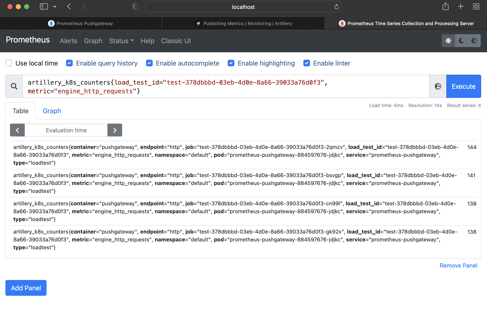

[](https://shields.io/)


# Running Load Tests

- [Example: LoadTest with local test reports](#example-loadtest-with-local-test-reports)
- [Example: LoadTest with test reports published to Prometheus](#example-loadtest-with-test-reports-published-to-prometheus)

## Pre-requisites

A cluster (remote or local) with artillery-operator [already deployed](#trial-in-your-own-cluster).

## Example: LoadTest with local test reports

The example is available at `hack/examples/basic-loadtest`.

It provides a load test configured with two workers and a target Api to test.

The example includes a [`kustomize`](https://kustomize.io) manifest which generates the ConfigMap required to hold the
test script used by the load tests. The `kustomize` manifest will also apply the Load Test Custom Resource manifest to
your cluster.

  ```shell
  kubectl apply -k hack/examples/basic-loadtest
  
  # configmap/test-script created
  # loadtest.loadtest.artillery.io/basic-test created
  
  kubectl get loadtests basic-test
  # NAME         COMPLETIONS   DURATION   AGE   ENVIRONMENT   IMAGE
  # basic-test   0/2           55s        55s   dev           artilleryio/artillery:latest
  ```

### Test reports

This LoadTest is NOT configured to publish results for aggregation across workers. As such, you'll have to check the
logs from each worker to monitor its test reports.

You can use a LoadTests created published `Events` to do this. E.g. let's find `basic-test`'s workers.

  ```shell
  kubectl describe loadtests basic-test
  
  # ...
  # ...
  # Status:
  # ...
  # Events:
  #  Type    Reason   Age   From                 Message
  #  ----    ------   ----  ----                 -------
  #  Normal  Created  25s   loadtest-controller  Created Load Test worker master job: basic-test
  #  Normal  Running  25s   loadtest-controller  Running Load Test worker pod: basic-test-6w2rq
  #  Normal  Running  25s   loadtest-controller  Running Load Test worker pod: basic-test-7fjxq
  ```

The `Events` section lists all the created workers. Using the first worker `basic-test-6w2rq`, we can follow its test
reports.

  ```shell
  kubectl logs -f basic-test-6w2rq
  ```

Displays:

  ```shell

Telemetry is on. Learn more: https://artillery.io/docs/resources/core/telemetry.html
Phase started: unnamed (index: 0, duration: 60s) 15:18:01(+0000)
  
  --------------------------------------
Metrics for period to: 15:18:10(+0000) (width: 7.007s)
  --------------------------------------

vusers.created_by_name.Access the / route: .................. 24
vusers.created.total: ....................................... 24
vusers.completed: ........................................... 24
...
...
  --------------------------------------
Metrics for period to: 15:18:20(+0000) (width: 9.013s)
  --------------------------------------
  ....
  ....
  ```

### LoadTest manifest

The `basic-test` load test is created using the `hack/examples/basic-loadtest/basic-test-cr.yaml` manifest.

  ```yaml
apiVersion: loadtest.artillery.io/v1alpha1
kind: LoadTest
metadata:
  name: basic-test
  namespace: default
  labels:
    "artillery.io/test-name": basic-test
    "artillery.io/component": loadtest
    "artillery.io/part-of": loadtest

spec:
  count: 2
  environment: dev
  testScript:
    config:
      configMap: test-script
  ```

It runs 2 workers against a test script loaded from `configmap/test-script`.

## Example: LoadTest with test reports published to Prometheus

The example is available at `hack/examples/published-metrics-loadtest`.

Rather than checking logs for each worker instance individually, this example showcases how to use Prometheus as a
central location to view and analyse test reports across Load Test workers.

### Working with Prometheus and Prometheus Pushgateway

This load test will be publishing worker test report details as metrics to [Prometheus](https://prometheus.io) using
the [Prometheus Pushgateway](https://prometheus.io/docs/instrumenting/pushing/).

**The Pushgateway is crucial to track our metrics in Prometheus**. Artillery will be pushing test report metrics to the
Pushgateway and then Prometheus will scrape that data from the Pushgateway to make it available for monitoring.

The instructions below will help you install Prometheus and the Pushgateway on your K8s cluster.

__Skip Ahead__ if you already have your own Prometheus and Pushgateway instances.

- Ensure you have [Helm](https://helm.sh/docs/intro/install/) installed locally.
- If you haven't yet, download or clone
  the `artillery-operator` [github repo](https://github.com/artilleryio/artillery-operator).
- Navigate to the root directory.
- Execute the following:

  ```shell
  # Ensure you have a running cluster
  kubectl get all --all-namespaces
  
  # Run setup script
  chmod +x hack/prom-pushgateway/up.sh
  ./hack/prom-pushgateway/up.sh
  # ...
  # ...
  # 1. Get the application URL by running these commands:
  #   export POD_NAME=$(kubectl get pods --namespace default -l "app=prometheus-pushgateway,release=prometheus-pushgateway" -o jsonpath="{.items[0].metadata.name}")
  #   echo "Visit http://127.0.0.1:8080 to use your application"
  #   kubectl port-forward $POD_NAME 8080:80
  # Forwarding from 127.0.0.1:9091 -> 9091
  # Forwarding from [::1]:9091 -> 9091
  ```

The `hack/prom-pushgateway/up.sh` script has:

- Installed Prometheus on K8s in the `monitoring` namespace.
- Installed the Pushgateway on K8s and it's running as the `svc/prometheus-pushgateway` service in the `default`
  namespace.
- As a convenience, `svc/prometheus-pushgateway` has been port-forwarded to `http://localhost:9091`.

Navigate to `http://localhost:9091` to view worker jobs already pushed to the Pushgateway - for now, there should be no
listings.

### Publishing test reports metrics

Publishing worker test report details as metrics requires configuring the `publish-metrics` plugin in
the `test-script.yaml` file with a `prometheus` type.

See `hack/examples/published-metrics-loadtest/test-script.yaml`.

  ```yaml
config:
  target: "http://prod-publi-bf4z9b3ymbgs-1669151092.eu-west-1.elb.amazonaws.com:8080"
  plugins:
    publish-metrics:
      - type: prometheus
        pushgateway: "http://prometheus-pushgateway:9091"
        prefix: 'artillery_k8s'
        tags:
          - "load_test_id:test-378dbbbd-03eb-4d0e-8a66-39033a76d0f3"
          - "type:loadtest"
...
...
  ```

If needed, please update the `pushgateway` field with details to where your Pushgateway is running.

`prefix` and `tags` configuration is optional. Use them to easily locate your test report metrics in Prometheus.

Consult [Publishing Metrics / Monitoring](https://www.artillery.io/docs/guides/plugins/plugin-publish-metrics)
for more info regarding the `artillery-publish-metrics` plugin.

### Running the load test

Similar to the [previous load test example](#example-loadtest-with-local-test-reports), you run the test
using [`kustomize`](https://kustomize.io).

  ```shell
  # Ensure the Artillery Operator is running on your cluster
  kubectl -n artillery-operator-system get deployment.apps/artillery-operator-controller-manager
  # NAME                                    READY   UP-TO-DATE   AVAILABLE   AGE
  # artillery-operator-controller-manager   1/1     1            1           27s
  
  # Run the load test
  kubectl apply -k hack/examples/published-metrics-loadtest
  # configmap/test-script created
  # loadtest.loadtest.artillery.io/test-378dbbbd-03eb-4d0e-8a66-39033a76d0f3 created
  
  # Ensure the test is running
  kubectl get loadtests test-378dbbbd-03eb-4d0e-8a66-39033a76d0f3
  # NAME                                        COMPLETIONS   DURATION   AGE   ENVIRONMENT
  # test-378dbbbd-03eb-4d0e-8a66-39033a76d0f3   0/4           60s        62s   staging
  
  # Find the load test's workers
  kubectl describe loadtests test-378dbbbd-03eb-4d0e-8a66-39033a76d0f3
  # ...
  # ...
  # Status:
  # ...
  # Events:
  #  Type    Reason     Age                    From                 Message
  #  ----    ------     ----                   ----                 -------
  #  Normal  Created    2m30s                  loadtest-controller  Created Load Test worker master job: test-378dbbbd-03eb-4d0e-8a66-39033a76d0f3
  #  Normal  Running    2m29s (x2 over 2m29s)  loadtest-controller  Running Load Test worker pod: test-378dbbbd-03eb-4d0e-8a66-39033a76d0f3-2qmzv
  #  Normal  Running    2m29s (x2 over 2m29s)  loadtest-controller  Running Load Test worker pod: test-378dbbbd-03eb-4d0e-8a66-39033a76d0f3-cn99l
  #  Normal  Running    2m29s (x2 over 2m29s)  loadtest-controller  Running Load Test worker pod: test-378dbbbd-03eb-4d0e-8a66-39033a76d0f3-bsvgp
  #  Normal  Running    2m29s (x2 over 2m29s)  loadtest-controller  Running Load Test worker pod: test-378dbbbd-03eb-4d0e-8a66-39033a76d0f3-gk92x
  ```

There are now 4 workers running as Pods with different names. These Pod names correspond to Pushgateway job IDs.

### Viewing test report metrics on the Pushgateway

Navigating to the Pushgateway, in our case at `http://localhost:9091`, you'll see:

  

Clicking on a job matching a Pod name displays the test report metrics for a specific worker:

- `artillery_k8s_counter`, includes counter based metrics like `engine_http_responses`, etc...
- `artillery_k8s_rates`, includes rates based metrics like `engine_http_request_rate`, etc...
- `artillery_k8s_summaries`, includes summary based metrics like `engine_http_response_time_min`, etc...

### Viewing aggregated test report metrics on Prometheus

In our case, we're running Prometheus in our K8s cluster, to access the dashboard we'll port-forward it to port `9090`.

  ```shell
  kubectl -n monitoring port-forward service/prometheus-k8s 9090
  # Forwarding from 127.0.0.1:9090 -> 9090
  # Forwarding from [::1]:9090 -> 9090
  ```

Navigating to the dashboard on `http://localhost:9090/` we can view aggregated test report metrics for our Load Test
across all workers.

Now enter into the search input field:

  ```text
  artillery_k8s_counters{load_test_id="test-378dbbbd-03eb-4d0e-8a66-39033a76d0f3", metric="engine_http_requests"}
  ```

This displays `engine_http_requests` metric for Load Test `test-378dbbbd-03eb-4d0e-8a66-39033a76d0f3`.

  

Now let's visualise the metrics by clicking the Graph tab.

  
